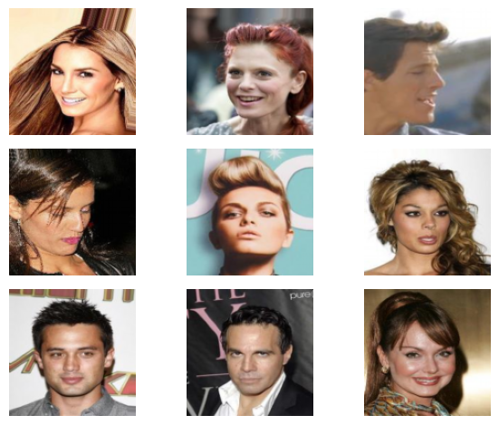

# Basic-VAE
Basic implementation of Varational Auto Encoder with pytorch.
Trained for MNIST dataset and CelebA dataset.

# Results

### MNIST
<table style="width: 100%; table-layout: fixed; border-collapse: collapse;">
  <tr>
    <th style="width: 33.33%; text-align: center;">Original Image</th>
    <th style="width: 33.33%; text-align: center;">Reconstructed Image</th>
    <th style="width: 33.34%; text-align: center;">Random Image</th>
  </tr>
  <tr>
    <td style="text-align: center;">
      
    </td>
    <td style="text-align: center;">
      
    </td>
    <td style="text-align: center;">
      
    </td>
  </tr>
</table>

### CelebA
<table style="width: 100%; table-layout: fixed; border-collapse: collapse;">
  <tr>
    <th style="width: 33.33%; text-align: center;">Original Image</th>
    <th style="width: 33.33%; text-align: center;">Reconstructed Image</th>
    <th style="width: 33.34%; text-align: center;">Random Image</th>
  </tr>
  <tr>
    <td style="text-align: center;">
      
    </td>
    <td style="text-align: center;">
      
    </td>
    <td style="text-align: center;">
      
    </td>
  </tr>
</table>
